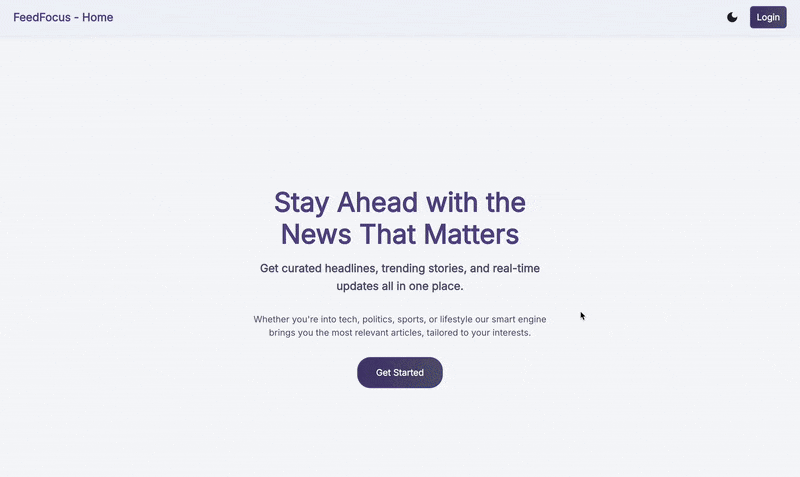

# Feed Focus

Feed Focus is a modern news aggregation platform with a modular architecture:

- **Frontend**: Built with React and Material UI for a responsive, personalized news experience. Features include user authentication (JWT), bookmarks, topic filtering, dark/light mode, and profile management.
- **Backend**: Powered by Spring Boot and MongoDB, providing secure user management, RSS feed aggregation, article storage, and personalized recommendations.



## Getting Started

1.  **Clone the repository**:
    ```
    git clone [https://github.com/mohanseetha/feed-focus.git](https://github.com/mohanseetha/feed-focus.git)
    ```

### Backend Setup

1.  Navigate to the backend directory:
    ```
    cd feed-focus/feed-focus-backend
    ```
2.  Configure your MongoDB connection in `src/main/resources/application.properties`.
3.  Start the backend application using Maven or Gradle.

### Frontend Setup

1.  Navigate to the frontend directory:
    ```
    cd feed-focus/feed-focus-frontend
    ```
2.  Install dependencies:
    ```
    npm install
    ```
3.  Set your backend API URL in a `.env` file (e.g., `VITE_API_URL=http://localhost:8080`).
4.  Start the frontend development server:
    ```
    npm run dev
    ```

For full setup and feature details, refer to the individual `README.md` files in the `feed-focus-backend` and `feed-focus-frontend` folders.
